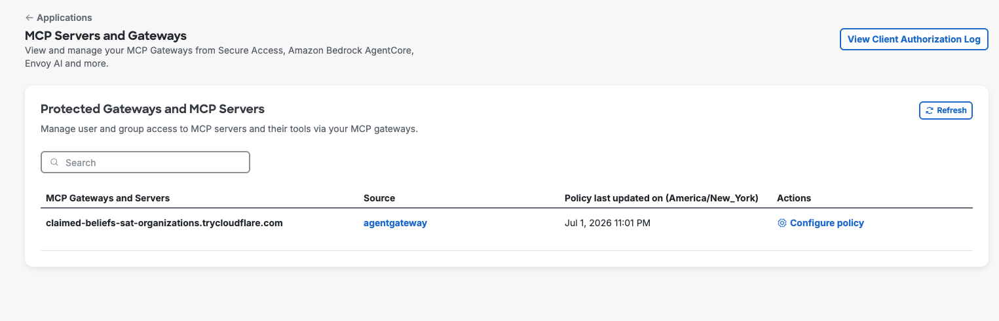
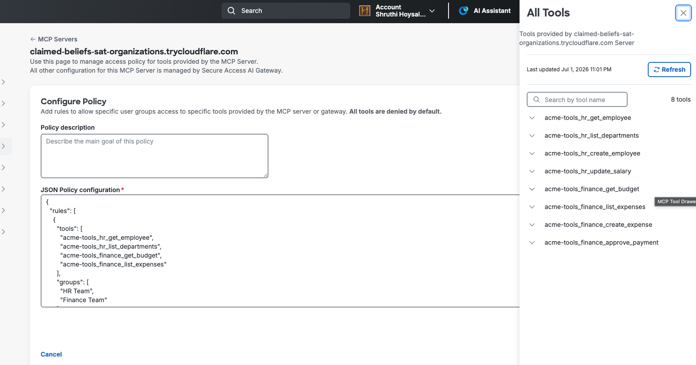
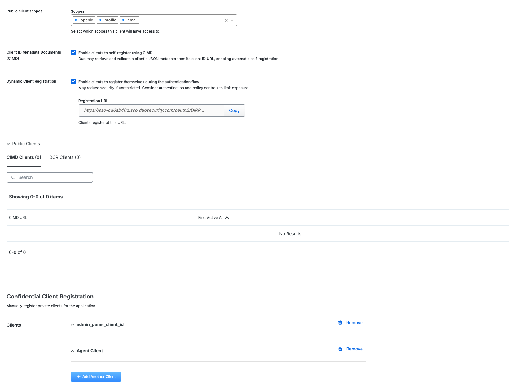
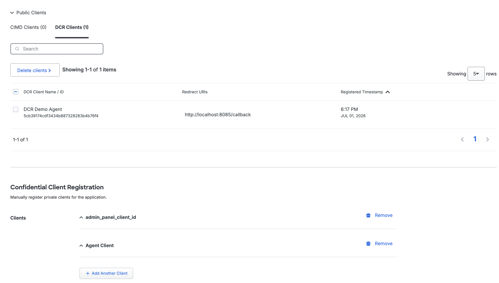
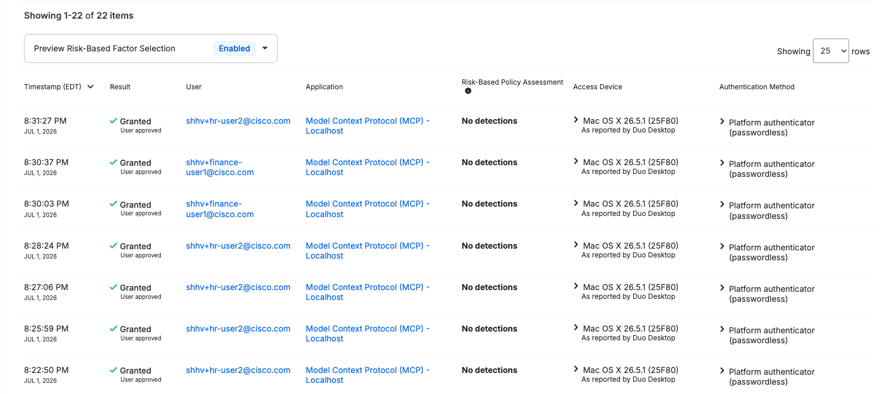
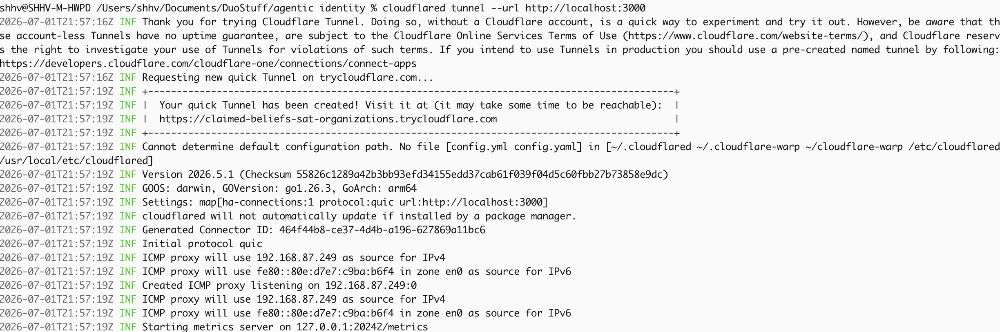

# Duo Agentic Identity Demo

Demonstrates Duo's agentic authorization for AI agents using the MCP protocol. Two scripted agents (HR and Finance) authenticate via Duo SSO and connect through agentgateway — showing how Duo policies enforce **shared read, split write** access to MCP tools.

**Key insight:** Same tools, same server, same client — different user, different permissions.

## What This Shows

| Script | User | Shared Reads | HR Writes | Finance Writes |
|--------|------|-------------|-----------|---------------|
| HR Agent | HR user | ✓ 4 tools | ✓ 2 tools | ✗ DENIED |
| Finance Agent | Finance user | ✓ 4 tools | ✗ DENIED | ✓ 2 tools |
| Any script | HR user | ✓ | ✓ | ✗ |
| Any script | Finance user | ✓ | ✗ | ✓ |

The script doesn't matter — **the user identity determines access**.

## Architecture

```
Agent scripts (Python)
    │
    │ OAuth Authorization Code + PKCE (browser-based Duo SSO)
    ▼
Cloudflare Tunnel (public HTTPS)
    │
    ▼
agentgateway (:3000)
    │
    ├── authz-bridge (:9001) → Duo Cloud API (policy evaluation)
    │
    ▼
MCP Server (:8000) — 8 tools, no auth, mock data
```

## Prerequisites

- Docker & Docker Compose v2+
- Python 3.11+
- Duo Premier subscription with Agentic Identity alpha access
- `cloudflared` CLI (`brew install cloudflared`)

### What you DON'T need

> This demo runs entirely from your laptop with only a **Duo Admin Panel login**. No cloud infrastructure required.

- No AWS / GCP / Azure account
- No public server or VM
- No purchased domain name or DNS setup
- No SSL certificate from a CA
- No Kubernetes cluster
- No corporate VPN or firewall changes

Cloudflare's free quick tunnel gives you a public HTTPS endpoint pointing back to localhost — Duo just needs a reachable URL.

---

## Screenshots

### Duo Admin — MCP Servers page
Your gateway appears here after services are running. Click "Configure policy" to set up rules.



### Configure Policy — JSON rules + tool list
Paste the JSON policy on the left. The tool drawer on the right shows all 8 tools discovered from your MCP server.



### Clients tab — Admin Panel + Agent Client
You need two confidential clients: one for the admin panel (tool fetching) and one for agent authentication.



### DCR Clients — dynamically registered clients appear here
After running `dcr_agent.py`, the self-registered client shows up under Public Clients → DCR Clients tab.



### Authentication Log — shows all agent logins
Duo Admin → Reports shows every authentication event against the MCP OIDC integration.



---

## First-Time Setup

### Step 1: Duo Admin — Create MCP OIDC Integration

1. **Applications → Application Catalog** → search "MCP" → add **"Model Context Protocol (MCP)"**
2. **General tab:**
   - Check **Client Credentials** (admin panel uses this)
   - Set **Sign-In Redirect URLs**: `http://localhost:8085/callback`
   - Set **Resource URLs**: `https://<your-tunnel>.trycloudflare.com/mcp` (add after Step 4)
3. **Clients tab:**
   - Rename default client to `MCPGW Tool List Client` — set scope to `openid`
   - Click **+ Add Another Client** → name it `Agent Client` — set scope to `openid`
   - Copy the **Agent Client's** Client ID and Client Secret

### Step 2: Duo Admin — Create agentgateway Integration

1. **Applications → Application Catalog** → search "agentgateway" → add it
2. Copy from **Details** section: API hostname, Integration key, Secret key
3. In **Connect Duo Authorization to Gateway Authentication**:
   - Select your MCP OIDC integration from the dropdown
   - Add agentgateway URL: `https://<your-tunnel>.trycloudflare.com/mcp`
   - Set gateway name (e.g. `mcpgw`)
4. Save

### Step 3: Duo Admin — Create Groups and Users

1. **Groups** → create `HR Team` and `Finance Team`
2. **Users** → create test users, assign to groups:
   - `hr-user@...` → HR Team
   - `finance-user@...` → Finance Team

### Step 4: Start the Cloudflare Tunnel

> **Run this in a separate terminal tab** — it blocks the terminal while running.

With Cloudflare Tunnel you **don't need**:
- An internet-resolvable fully qualified DNS entry
- An SSL certificate purchased from a commercial certificate authority (CA)

Cloudflared creates an outbound-only connection from your machine to Cloudflare's edge — Cloudflare handles DNS and TLS for you. Your local service stays plain HTTP on localhost.

```bash
cloudflared tunnel --url http://localhost:3000
```

The URL changes every time you restart (free tier limitation). Copy the generated URL
(e.g. `https://random-words.trycloudflare.com`) — look for it in the output:



Now go back to Duo Admin and paste `https://<your-url>/mcp` into:
- MCP OIDC integration → General tab → **Resource URLs**
- agentgateway integration → **agentgateway URLs**

### Step 5: Configure This Project

The easiest way is to run the interactive setup script — it asks for all values and generates everything:

```bash
cd duo-agentic-identity-demo
make setup
```

This will prompt for your Duo credentials and automatically create:
- `quickstart.conf` (gateway config)
- `.env` (agent config)
- `secrets/duo_skey` (secret key file)

**Or configure manually:**

1. Copy the templates:
   ```bash
   cp quickstart.conf.example quickstart.conf
   cp .env.example .env
   ```

2. Create the secret key file — this is the **Secret key** from Duo Admin → Applications → your **agentgateway** integration → **Details** section (the one next to Integration key and API hostname):
   ```bash
   mkdir -p secrets
   echo -n "paste-agentgateway-secret-key-here" > secrets/duo_skey
   chmod 600 secrets/duo_skey
   ```

3. Edit `quickstart.conf` with your values:
   - `gateway.external_url` → your tunnel URL + `/mcp`
   - `oauth.issuer` → your Duo SSO issuer URL (Token URL without `/token`)
   - `oauth.admin_panel_client_id` → MCPGW Tool List Client's Client ID
   - `duo.host` → API hostname from agentgateway integration
   - `duo.integration_key` → Integration key from agentgateway integration

4. Edit `.env` with your values:
   - `OAUTH_AUTHORIZE_URL` → `https://sso-XXXX.sso.duosecurity.com/oauth2/XXXX/authorize`
   - `OAUTH_TOKEN_URL` → `https://sso-XXXX.sso.duosecurity.com/oauth2/XXXX/token`
   - `OAUTH_CLIENT_ID` → **Agent Client** Client ID (NOT the admin panel one)
   - `OAUTH_CLIENT_SECRET` → Agent Client Secret
   - `GATEWAY_URL` → your tunnel URL + `/mcp`

### Step 6: Start Services

```bash
COMPOSE_PROFILES=agentgateway docker compose up -d
```

Verify:
```bash
docker ps  # Should show: mcp-server, authz-bridge, agentgateway
docker logs authz-bridge 2>&1 | grep "health check passed"
docker logs agentgateway 2>&1 | grep "server ready"
```

### Step 7: Configure Duo Authorization Policy

1. Duo Admin → **Applications → MCP Servers** → find your gateway → **Configure policy**
2. Paste this policy JSON:

```json
{
  "rules": [
    {
      "group": "HR Team",
      "tools": [
        "acme-tools_hr_get_employee",
        "acme-tools_hr_list_departments",
        "acme-tools_hr_create_employee",
        "acme-tools_hr_update_salary",
        "acme-tools_finance_get_budget",
        "acme-tools_finance_list_expenses"
      ]
    },
    {
      "group": "Finance Team",
      "tools": [
        "acme-tools_hr_get_employee",
        "acme-tools_hr_list_departments",
        "acme-tools_finance_get_budget",
        "acme-tools_finance_list_expenses",
        "acme-tools_finance_create_expense",
        "acme-tools_finance_approve_payment"
      ]
    }
  ]
}
```

3. Save policy

### Step 8: Run the Demo

```bash
cd agents
python3 -m venv .venv && source .venv/bin/activate
pip install -r requirements.txt
export $(grep -v '^#' ../.env | xargs)
```

**Test 1: Pre-configured client (HR user)**
```bash
python3 hr_agent.py
```
- Opens browser → log in as an HR Team user
- Script authenticates, connects to agentgateway, tries all 8 tools
- Expected: 6 allowed (4 reads + 2 HR writes), 2 denied (finance writes)

**Test 2: Pre-configured client (Finance user)**
```bash
python3 finance_agent.py
```
- Opens browser → log in as a Finance Team user
- Expected: 6 allowed (4 reads + 2 finance writes), 2 denied (HR writes)

**Test 3: Dynamic Client Registration**
```bash
python3 dcr_agent.py
```
- Registers a brand new OAuth client with Duo SSO on the fly (no admin setup)
- Opens browser → log in as any user
- Proves: policy follows the user, not the client — even unknown clients are governed
- Check Duo Admin → MCP OIDC integration → Clients tab → DCR section — you'll see the new client appear

**After each test, check:**
- Duo Admin → **Reports → Client Authorization Log** — shows every tool call with allow/deny
- Terminal output — color-coded ALLOWED/DENIED per tool
- `docker logs authz-bridge` — shows the raw policy decisions and group lookups

---

## Returning / Repeat Use

The Cloudflare quick tunnel URL changes every time you restart it. When that happens:

### Update these 3 places:

1. **`quickstart.conf`** → update `gateway.external_url`
2. **`.env`** → update `GATEWAY_URL`
3. **Duo Admin Panel** (both of these):
   - MCP OIDC integration → General tab → **Resource URLs**
   - agentgateway integration → **agentgateway URLs**

### Then restart:

```bash
make down && make up
```

Verify containers are running:
```bash
docker ps  # Should show: mcp-server, authz-bridge, agentgateway
```

### Run the demo:

```bash
cd agents
source .venv/bin/activate
export $(grep -v '^#' ../.env | xargs)

python3 hr_agent.py        # Log in as HR user → 6/8 allowed
python3 finance_agent.py   # Log in as Finance user → 6/8 allowed
python3 dcr_agent.py       # Self-registers a new client, log in as any user
```

### Tip: Use a Named Tunnel for Stable URLs

To avoid updating URLs every session, create a permanent tunnel:

```bash
cloudflared tunnel login          # One-time: links to your Cloudflare account
cloudflared tunnel create duo-demo
cloudflared tunnel route dns duo-demo demo.yourdomain.com
cloudflared tunnel run --url http://localhost:3000 duo-demo
```

Then use `https://demo.yourdomain.com/mcp` everywhere — it never changes.

---

## Project Structure

```
├── quickstart.conf          # Gateway + authz-bridge config (edit with your values)
├── docker-compose.yml       # MCP server, authz-bridge, agentgateway
├── secrets/
│   └── duo_skey             # Duo secret key (gitignored)
├── config/                  # Generated configs (auto-created by init containers)
├── mcp-server/
│   ├── Dockerfile
│   └── src/
│       ├── server.py        # FastAPI MCP server (Streamable HTTP + SSE)
│       ├── tools.py         # 8 tool definitions + mock implementations
│       └── mock_data.py     # Fake employees, budgets, expenses
├── agents/
│   ├── hr_agent.py          # Demo script: tries all 8 tools as HR user
│   ├── finance_agent.py     # Demo script: tries all 8 tools as Finance user
│   ├── requirements.txt
│   └── shared/
│       ├── auth.py          # OAuth Authorization Code + PKCE flow
│       ├── mcp_client.py    # Streamable HTTP MCP client for agentgateway
│       └── output.py        # ANSI colored terminal output
├── .env                     # Your credentials (gitignored)
├── .env.example             # Template
└── docs/
    ├── DUO_SETUP.md
    ├── CLOUDFLARE_SETUP.md
    └── DEMO_SCRIPT.md
```

## Troubleshooting

| Symptom | Cause | Fix |
|---------|-------|-----|
| Token acquired but all tools "Unauthorized" | Wrong Client ID (using admin panel client) | Use the **Agent Client** ID in `.env`, not the MCPGW Tool List Client |
| Token acquired but all tools "Forbidden" | User not in any policy group | Check user's group membership in Duo Admin |
| "admin panel client: non-listing operation" in authz-bridge logs | Same as above — using admin panel client for tool calls | Switch `OAUTH_CLIENT_ID` to Agent Client |
| "InvalidAudience" in agentgateway logs | Token doesn't have the gateway URL as audience | Add `resource` param to auth request (already in code) — verify `GATEWAY_URL` matches Resource URLs in Duo |
| Tools list works but calls return 500 "Unknown tool" | Policy denies the tool for this user | This IS the enforcement working — expected for denied tools |
| 405 Method Not Allowed on upstream | MCP server doesn't handle POST on the SSE endpoint | Already fixed in this repo — ensure MCP server is rebuilt |
| Tunnel unreachable | Quick tunnel died | Restart `cloudflared tunnel --url http://localhost:3000` and update URLs |
| "Authentication timed out" | Browser redirect didn't reach localhost:8085 | Check `http://localhost:8085/callback` is in Sign-In Redirect URLs |

## Key Concepts

- **agentgateway** — proxy that sits in front of MCP servers, enforces auth + policy
- **authz-bridge** — Duo's authorization connector, evaluates policies against Duo Cloud
- **MCP Server** — exposes tools (no auth needed, trusts internal network)
- **Policy** — maps Duo user groups → allowed tools, configured in Duo Admin Panel
- **Streamable HTTP** — the MCP transport agentgateway uses (POST JSON-RPC, get JSON/SSE back)

---

## What's Happening Underneath

### How the Duo integrations relate to each other

```
Duo Admin Panel
├── MCP OIDC Integration (authentication layer)
│   ├── Defines: token URL, issuer, redirect URIs, Resource URLs
│   ├── Client 1: admin_panel_client_id → Duo Admin uses to fetch tools
│   └── Client 2: Agent Client → users/agents authenticate with this
│
└── agentgateway Integration (authorization layer)
    ├── Has: API hostname, Integration key, Secret key
    │   (authz-bridge uses these to talk to Duo Cloud)
    │
    └── "Connect Duo Authorization to Gateway Authentication"
         ├── Points to: the MCP OIDC integration above
         ├── Copies over: OAuth Token URL, Client ID, Client Secret
         └── agentgateway URLs: where the gateway lives (your tunnel URL)
```

### Why the link between integrations exists

The agentgateway needs to validate tokens. When a user authenticates, they get a token
from the MCP OIDC integration. agentgateway needs to know "tokens from *which* issuer
should I trust?" — the link tells it "trust tokens from this specific MCP OIDC integration."

### Why two clients?

| Client | Purpose | Can do |
|--------|---------|--------|
| `admin_panel_client_id` | Duo Admin Panel fetches tools for the policy UI | `initialize`, `tools/list` only — never `tools/call` |
| `Agent Client` | Actual users/agents authenticate with this | Everything — governed by policy |

The admin panel client exists so Duo Admin can discover your tools and show them in the
policy editor. It's a machine-to-machine credential that never calls tools — just lists them.

### How this scales in production

With 5 MCP servers in production:

```yaml
# quickstart.conf (or production equivalent)
upstreams:
  - name: slack
    url: "http://slack-mcp:3000/mcp"
  - name: github
    url: "http://github-mcp:8080/mcp"
  - name: jira
    url: "http://jira-mcp:8080/mcp"
  - name: salesforce
    url: "http://salesforce-mcp:8080/mcp"
  - name: hr-system
    url: "http://hr-mcp:8000/sse"
```

You still only need:
- **1 MCP OIDC integration** (one authentication source)
- **1 agentgateway integration** (one gateway)
- **1 link** between them
- **Same 2 clients** (admin panel + agent)

The 5 upstream MCP servers are just URLs in the gateway's config — Duo Admin doesn't
need to know about them individually. Tools from all servers appear in one unified
policy editor, prefixed by upstream name (`slack_post_message`, `github_create_pr`, etc.).

### What flows where

```
1. User runs agent script
2. Browser opens → Duo SSO login → token issued (by MCP OIDC integration)
3. Agent sends token + tool call to agentgateway (via tunnel)
4. agentgateway validates token audience (must match Resource URLs)
5. agentgateway asks authz-bridge: "Can this user call this tool?"
6. authz-bridge calls Duo Cloud API (using agentgateway integration keys)
7. Duo Cloud checks: user's groups → policy rules → allowed tools list
8. Response: ALLOW or DENY
9. If allowed: agentgateway forwards request to upstream MCP server
10. MCP server executes tool, returns result back through the chain
```

### What the MCP servers know

Nothing about auth. They receive requests from agentgateway over the internal Docker
network with no authentication. They don't know who the user is, what group they're in,
or whether the call was authorized. All of that is handled before the request arrives.

This is the value: **you don't embed auth decisions in each tool — Duo policy controls
it centrally, and you can change who has access without touching any server code.**

### How agentgateway talks to multiple MCP servers

One agentgateway instance, multiple upstreams — like nginx or any reverse proxy:

```
One agentgateway container
  ├── connects to slack-mcp:3000
  ├── connects to github-mcp:8080
  ├── connects to jira-mcp:8080
  └── connects to hr-mcp:8000
```

agentgateway calls `tools/list` on each upstream, combines them into one list (prefixed
by upstream name to avoid collisions), and serves the combined list to clients. When Duo
Admin clicks "Configure policy," it asks agentgateway "what tools do you have?" and gets
everything in one shot. You don't register each MCP server separately in Duo Admin —
only the gateway.

There's no `quickstart.conf` in production. That's a demo shortcut that *generates* the
actual `agentgateway.conf` via configgen. In production you'd write `agentgateway.conf`
directly (or generate it via Terraform/Helm/Kubernetes ConfigMaps).

---

## Demo vs Production — What's the Same, What's Different

### The stack

| Component | What it is | Open source? |
|-----------|-----------|-------------|
| [agentgateway](https://github.com/agentgateway/agentgateway) | MCP proxy/gateway (routing, auth, observability) | Yes — open source by Cisco |
| authz-bridge (Authorization Connector) | Sidecar that evaluates policies against Duo Cloud | No — Duo commercial product |
| Duo Cloud + Admin Panel | Policy management, group membership, audit logs | No — Duo SaaS |

agentgateway works standalone as an MCP proxy — no Duo required. Duo adds the
authorization layer on top via the authz-bridge sidecar.

### What's the same in production

- **agentgateway** — same binary, same config format, same behavior
- **authz-bridge** — same container, same connection to Duo Cloud
- **Duo Admin Panel** — same policy UI, same group-to-tool rules
- **Architecture** — one gateway, one authz-bridge, N upstream MCP servers
- **Auth flow** — OAuth + PKCE via Duo SSO, tokens validated by gateway

### What's different in this demo vs production

| This demo | Production |
|-----------|-----------|
| Free Cloudflare quick tunnel (URL changes every restart) | Load balancer with real TLS cert + stable DNS |
| `quickstart.conf` → configgen → generated configs | Write `agentgateway.conf` directly or via IaC |
| `./secrets/duo_skey` file on disk | Kubernetes Secrets, HashiCorp Vault, AWS Secrets Manager |
| `docker compose up` | Kubernetes, ECS, or VMs with proper orchestration |
| Our mock MCP server (Python dicts in memory) | Real MCP servers (Slack, GitHub, Jira, Salesforce, internal APIs) |
| Manual browser login per agent run | AI clients (Claude Code, Copilot) handle auth natively |
| Custom Python MCP client script | Use official MCP SDK or built-in client support |

### In production you would NOT need

- This repo's `mcp-server/` — you'd use real MCP servers
- This repo's `agents/` scripts — your AI tool (Claude Code, etc.) IS the client
- The `cloudflared` container — you'd have a real ingress
- The `quickstart.conf` — you'd manage configs with your IaC tooling

### In production you WOULD keep

- The agentgateway + authz-bridge containers (same images)
- The Duo Admin configuration (same integrations, same policies)
- The pattern: one gateway → many upstream MCP servers → policy in Duo
